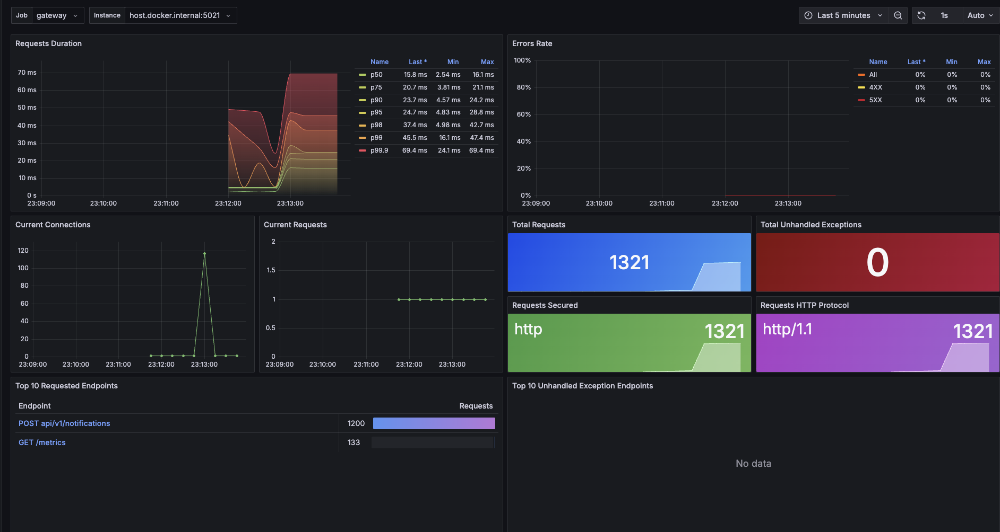
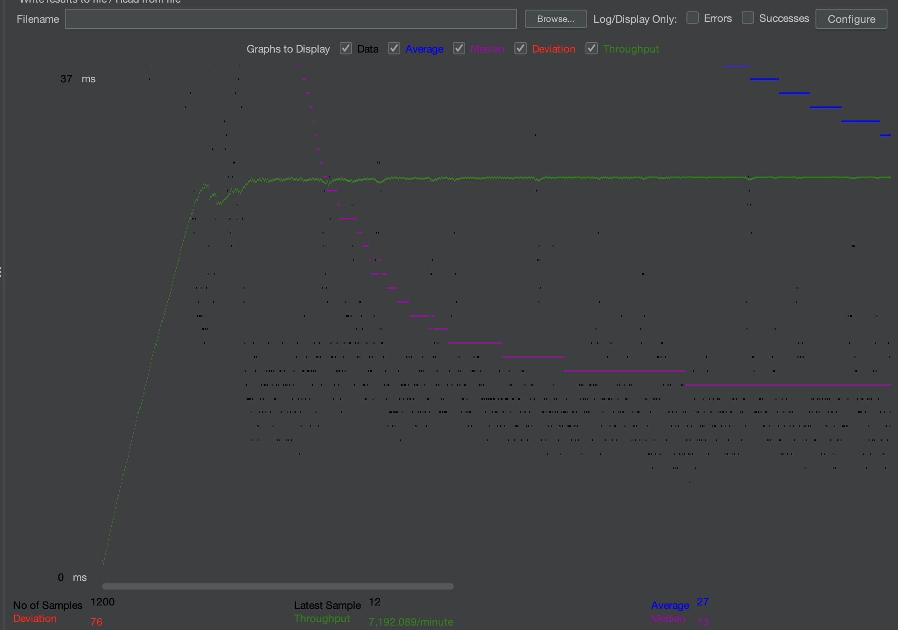
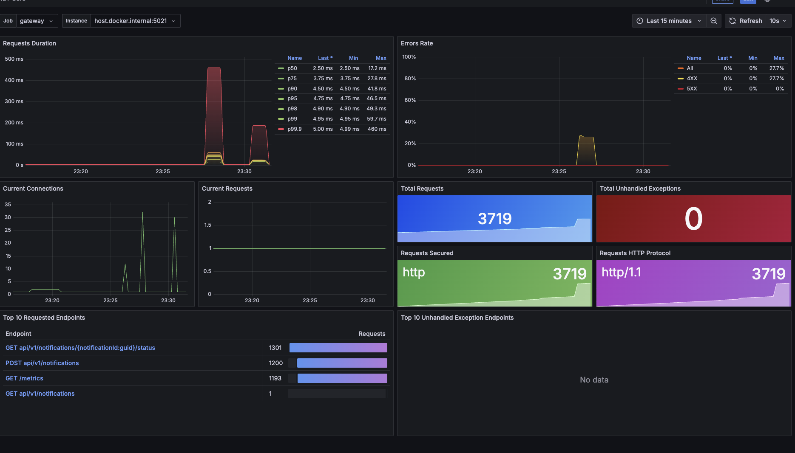
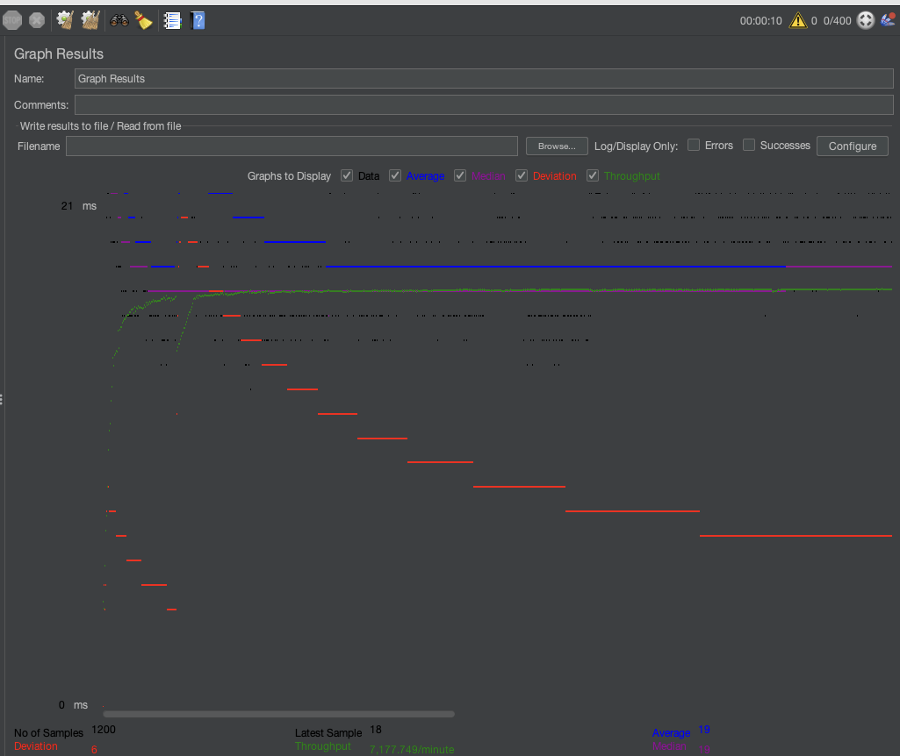

# NotificationsProject
### Реализация распределенного сервиса отправки уведомлений на разные источники (SMS, Push и Email)

### Результаты тестирования для метода: Post `api/v1/notifications`

- **Количество запросов (No of samples):** 1200
- **Последний запрос (Latest sample):** 12 мс
- **Среднее время отклика (Average):** 27 мс
- **Пропускная способность (Throughput):** 7,192.089 запросов в минуту
- **Стандартное отклонение (Deviation):** 76 мс
- **Медианное время отклика (Median):** 13 мс

### Результаты тестирования для метода: Get `api/v1/notifications/{id}/status`

- **Количество запросов (No of samples):** 1200
- **Последний запрос (Latest sample):** 18 мс
- **Среднее время отклика (Average):** 19 мс
- **Стандартное отклонение (Deviation):** 6 мс
- **Пропускная способность (Throughput):** 7,177.749 запросов в минуту
- **Медианное время отклика (Median):** 19 мс

## Преимущества решения
- **Масштабируемость:** каждый микросервис может быть развернут независимо, обеспечивая гибкость и отказоустойчивость.
- **Простота интеграции:** REST API и единая архитектура упрощают подключение новых источников и потребителей уведомлений.
- **Удобный мониторинг и логирование:** с использованием Prometheus, Grafana, Elasticsearch и Kibana.
- **Расширяемость:** возможность добавления новых каналов уведомлений и типов сообщений без изменения существующей архитектуры.
